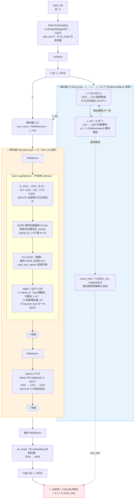
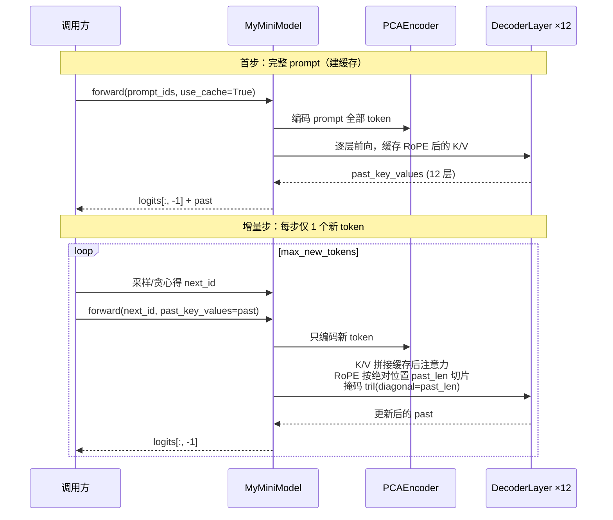

# MyMini 模型架构

> 与 [mymini.py](mymini.py) 同步更新。每次修改架构时同步本文档。

## 总体结构

## 推理路径（KV cache + generate）

## 训练配套

| 项目 | 配置 |
|---|---|
| 总损失 | `CE(shift) + recon_loss_coef(0.1) × Σ各块重构MSE` |
| 优化器 | AdamW 三参数组：embedding 组 lr×0.3 无衰减 / 矩阵组 wd=0.01 / 1D 参数无衰减 |
| 显存控制 | 梯度检查点默认开启（use_cache 时自动禁用）、bf16 autocast |
| 监控 | 日志含 `emb_g`（共享 embedding 梯度范数） |
| 显存实测 | RTX 3060 12GB：bs=16×accum2, seq=340 约 4.6GB |

## 关键设计约束

1. **编码器非死支路**：重构增益 `g = 2·√(hidden/latent)` 补偿 SiLU 斜率(0.5)与转置投影能量损失(latent/hidden)，初始 ‖x_rec‖/‖x‖ ≈ 1
2. **无 softmax**：log 域 clamp ±4 → 权重比 ≤ e⁸，log-sum-exp 归一化在 fp32 下进行
3. **多头正交**：Q/K/V/O 按头切片正交初始化（测试断言 WᵢWᵢᵀ ≈ I）
4. **KV cache 一致性**：缓存存 RoPE 之后的 K/V，数值与无缓存前向 max diff ≈ 3e-7
